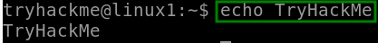
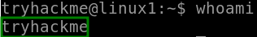
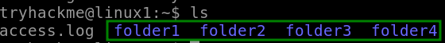
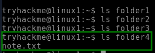
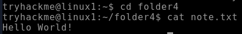
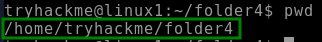
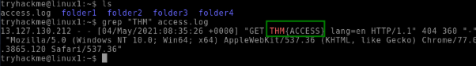
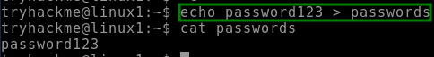
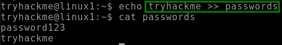

** Linux Fundamentals Part 1**

**Tarea 1: Introduccion**

Introduccion

**Tarea 2: Un poco de historia sobre Linux**

1) **Investigación: ¿En qué año se lanzó el primer sistema operativo Linux?**

El primer kernel de Linux fue lanzado en ***1991*** por Linus Torvalds. Fue la primera versión de Linux, 0.01.

**Tarea 3: Interactuando con su primera máquina Linux (en el navegador)**

***¡He implementado mi primera máquina Linux!***

**Tarea 4: Ejecutando sus primeros comandos**

1) **Si quisiéramos mostrar el texto " TryHackMe ", ¿cuál sería nuestro comando?**

El comando seria: ***echo TryHackMe***

**\
`		`*Figure 1 (echo TryHackMe)*

*Utilizamos “echo” para imprimir un texto proporcionado.*

1) ***¿Cuál es el nombre de usuario con el que ha iniciado sesión en su máquina Linux implementada?***

El nombre de usuario es: ***tryhackme***

*Figure 2 (whoami)*

Utilizamos “whoami” para saber que usuario esta logueado.

**Tarea 5: ¡Interactuando con el sistema de archivos!**

1) ***En la máquina Linux que está implementando, ¿cuántas carpetas hay?***

En el directorio hay ***4*** carpetas

`			`*Figure 3 (uso de ls para conocer los archivos)*

Utilizamos “ls” para saber que archivos hay en este directorio.

1) ***¿Qué directorio contiene un archivo?*** 

El directorio ***folder4*** contiene un archivo “note.txt”

*Figure 4 (carpeta 4 con archivos)*

Utilizamos “ls” para saber en que carpeta hay archivos.

1) ***¿Cuál es el contenido de este archivo?***

El contenido de “note.txt” es “***Hello World!***”

*Figure 5 (uso de “cat”)*

Utilizamos “cat” para ver el contenido de un archivo especifico

1) ***Usa el comando cd para navegar a este archivo y encontrar el nuevo directorio de trabajo actual. ¿Cuál es la ruta?***

Despues de usar el comando “pwd” nos da con la ruta para ver el directorio de trabajo actual ***/home/tryhackme/folder4***

*Figure 6 (uso de “pwd”)*

Utilizamos “pwd” para saber el directorio de trabajo actual.

**Tarea 6: Buscando archivos**

1) ***Use grep en "access.log" para encontrar la bandera con el prefijo "THM". ¿Cuál es la bandera? Nota: El archivo "access.log" se encuentra en el directorio "/home/tryhackme/".***

Despues de usar “grep” con el prefijo “THM” y aclarando que es en el archivo “access.log” nos da con la flag “***THM{ACCESS}”***

*Figure 7 (uso de “grep”)*

Utilizamos “grep” para en este caso buscar el prefijo especifico “THM”

**Tarea 7: Introducción a los operadores de Shell**

1) ***Si quisiéramos ejecutar un comando en segundo plano, ¿qué operador utilizaríamos?***

   Utilizaria el comando ***“&”*** ya que este operador nos permite ejecutar comandos en segundo plano. Por ejemplo, supongamos que queremos copiar un archivo grande. Esto, obviamente, tardará bastante tiempo y no podremos hacer nada más hasta que el archivo se copie correctamente.

1) ***Si quisiera reemplazar el contenido de un archivo llamado "contraseñas" con la palabra "contraseña123", ¿cuál sería mi comando?***

   *Utilizaria el comando **“echo password123 > passwords”***  ya que este  operador se conoce como redireccionador de salida y sobreescribe el contenido del archivo.

   

*Figure 8 (uso de* “> *”)*

1) ***Ahora bien, si quisiera agregar "tryhackme" a este archivo llamado "contraseñas" pero también conservar "contraseñas123", ¿cuál sería mi comando?***

   Utilizaria el comando ***“echo tryhackme >> passwords”*** ya que  este operador es un redireccionador de salida. Sin embargo, lo que lo diferencia con el operador  “>”  es que, en lugar de sobrescribir el contenido de un archivo, simplemente coloca la salida al final.		

   `			`*Figure 9 (uso de* “>>*”)*

**Tarea 8: Conclusiones y resúmenes**

Conclusion con resumen

**Tarea 9: Fundamentos de Linux Parte 2**

Presentacion 2da parte del room de la plataforma
